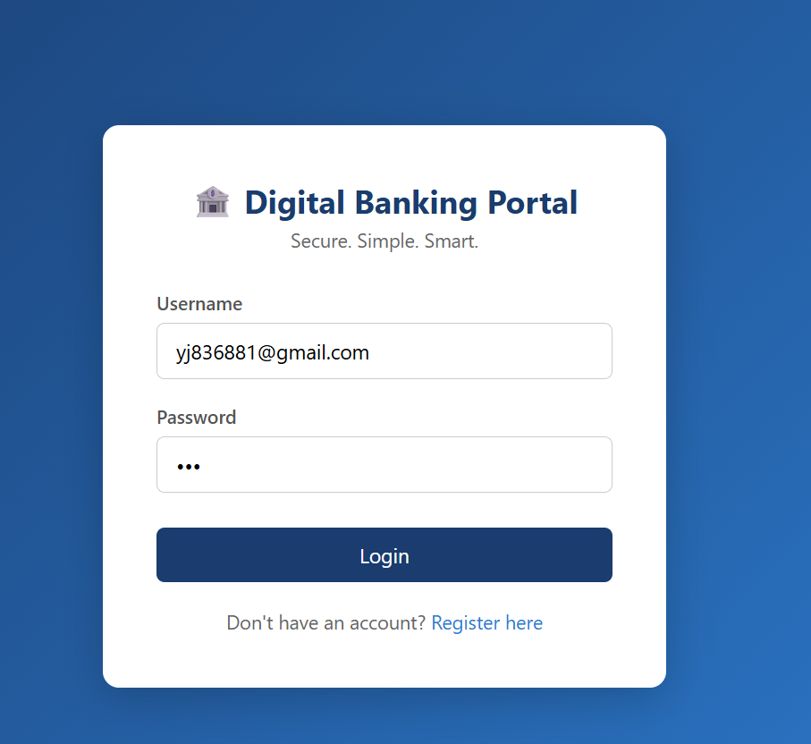
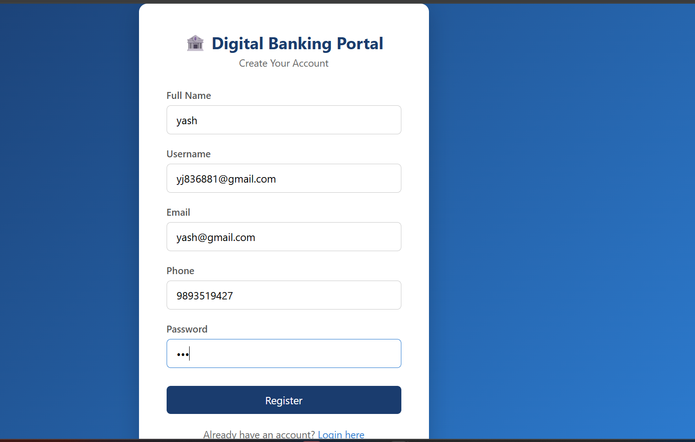
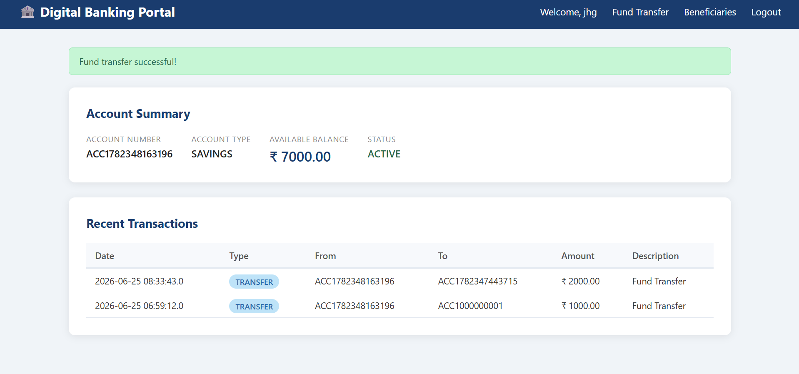
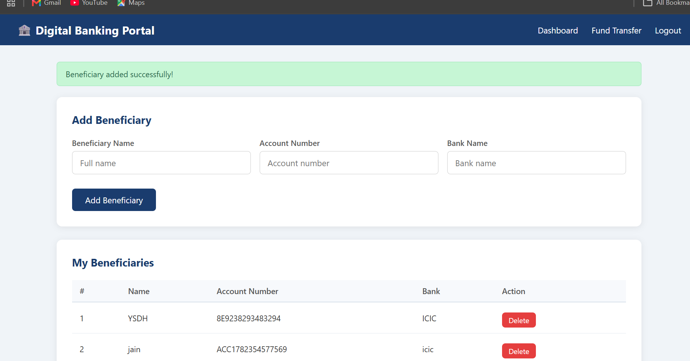
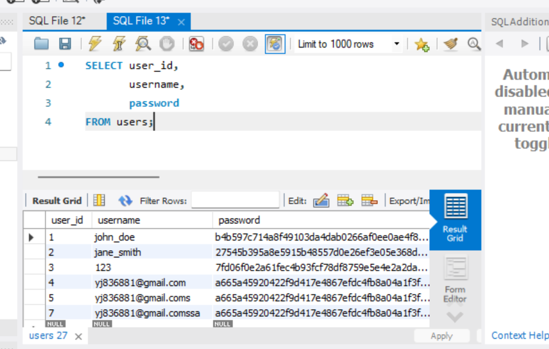
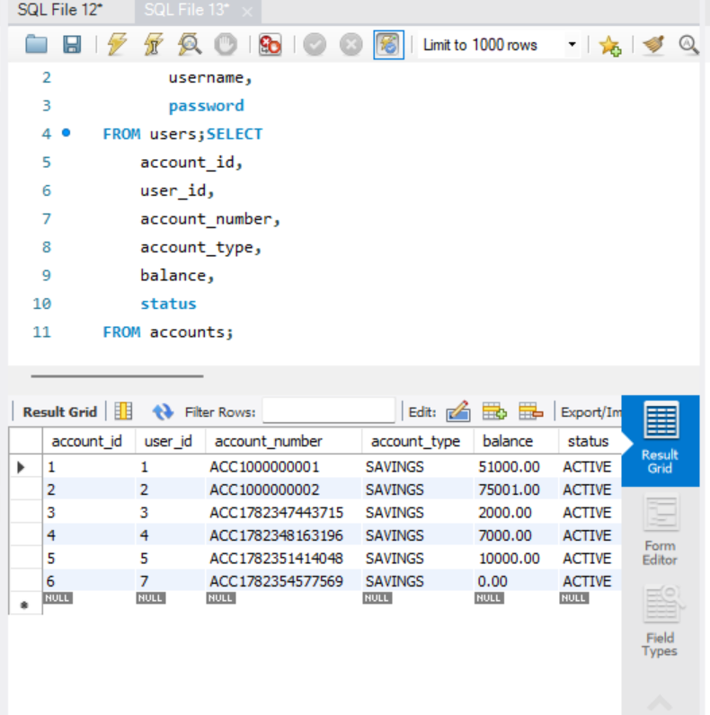

# Digital Banking Portal

### Java Web Application | JSP + Servlets + JDBC + MySQL

A secure Internet Banking System developed using **Core Java, JSP, Servlets, JDBC, and MySQL** following the **MVC architecture**. The application provides secure authentication, fund transfer with database transactions, beneficiary management, and transaction history.

---

# Features

* User Registration & Login
* Secure Password Hashing (SHA-256)
* Session-Based Authentication
* Account Dashboard
* Balance Inquiry
* Fund Transfer with JDBC Transactions (Commit/Rollback)
* Transaction History (Latest 10 Transactions)
* Beneficiary Management (Add / Delete)
* Username & Email Validation
* Phone Number Validation (10 Digits)
* Logout

---

# Tech Stack

| Layer      | Technology       |
| ---------- | ---------------- |
| Frontend   | JSP, HTML, CSS   |
| Backend    | Java Servlets    |
| Database   | MySQL, JDBC      |
| Server     | Apache Tomcat 9+ |
| Build Tool | Maven            |
| IDE        | Apache NetBeans  |

---

# Project Structure

```text
DigitalBankingPortal/
│
├── database/
│   └── digital_banking.sql
│
├── src/
│   └── main/
│       ├── java/
│       │   └── com/banking/
│       │       ├── dao/
│       │       ├── model/
│       │       ├── servlet/
│       │       └── util/
│       │
│       └── webapp/
│           ├── WEB-INF/
│           │   ├── views/
│           │   └── web.xml
│           └── css/
│
├── pom.xml
└── README.md
```

---

# Project Screenshots

## Login Page



---

## Registration Page



---

## Dashboard


---

## Fund Transfer


---

## Successful Transfer



---

## Beneficiary Management



---

## Users Table (SHA-256 Password Hashing)



---

## Accounts Table



---

## Transactions Table


---

# Setup Instructions

## Prerequisites

* JDK 11+
* Apache Tomcat 9+
* MySQL 8+
* Maven 3+
* Apache NetBeans

---

## Step 1 : Database Setup

Import the SQL file located inside the `database` folder.

```sql
source database/digital_banking.sql;
```

---

## Step 2 : Configure Database

Update your MySQL credentials in:

```text
src/main/java/com/banking/util/DBConnection.java
```

```java
private static final String URL = "jdbc:mysql://localhost:3306/digital_banking";
private static final String USERNAME = "root";
private static final String PASSWORD = "your_mysql_password";
```

---

## Step 3 : Build the Project

```bash
mvn clean package
```

---

## Step 4 : Deploy

Deploy the generated WAR file to Apache Tomcat.

Open:

```
http://localhost:8080/DigitalBankingPortal/login
```

---

# Security Features

* SHA-256 Password Hashing
* Prepared Statements (SQL Injection Protection)
* Session-Based Authentication
* JDBC Transaction Management
* Connection per Request
* Fund Transfer Rollback on Failure
* Username & Email Validation
* Phone Number Validation
* Beneficiary Validation

---

# Key Concepts Demonstrated

* MVC Architecture
* Object-Oriented Programming
* DAO Design Pattern
* JDBC
* Java Servlets
* JSP
* Session Management
* SQL Transactions
* Prepared Statements
* MySQL Database Design

---

# Future Enhancements

* OTP Verification
* Email Notifications
* Password Reset
* Role-Based Access Control
* Account Statement PDF Export
* Spring Boot Migration
* REST API Support

---

# Author

**Yash Jain**

MCA (2025–2027)

VIT Chennai

GitHub: https://github.com/YOUR_GITHUB_USERNAME
